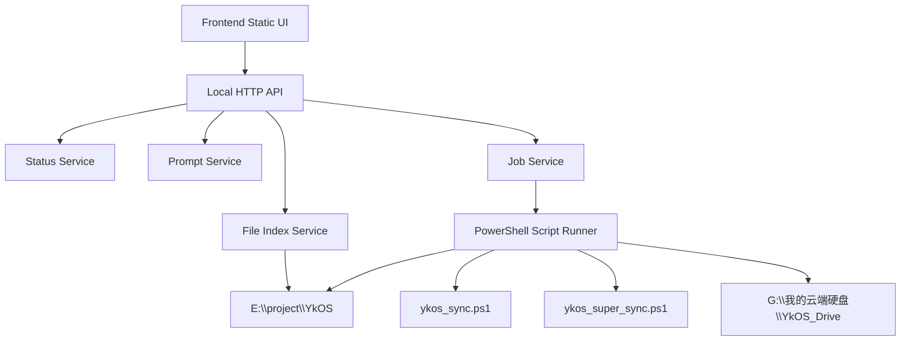

# YkOS Control Panel 后端设计

## 定位

YkOS Control Panel 后端是一个本地控制服务，负责把 GUI 操作转成可审计的本地文件读取、提示词生成和脚本调用。

它不是云服务，不是 Agent 平台，不是数据库，也不替代 Markdown 知识库。

## 设计目标

- 给前端提供稳定 API。
- 读取 YkOS 当前状态。
- 调用已有同步脚本。
- 生成可复制的 AI 工具提示词。
- 展示 inbox、pending、daily review、最新记忆快照。
- 保持所有操作可解释、可追踪、可审计。

## 非目标

- 不接 OpenAI / Gemini / GitHub API。
- 不做网络爬虫。
- 不做 MCP Server。
- 不自动审批 Memory Transaction。
- 不直接写入 `02_knowledge/`。
- 不引入数据库。
- 不让浏览器直接执行任意 shell 命令。

## 技术路线

v0.4 推荐使用 Python 标准库实现：

```text
E:\project\YkOS-ControlPanel\backend\ykos_control_panel_server.py
```

原因：

- Windows 本地可直接运行。
- 不需要安装依赖。
- 可以用 `http.server` 暴露本地 API。
- 可以用 `subprocess` 调用 PowerShell 脚本。
- 可以用 `json`、`pathlib`、`datetime`、`hashlib` 处理本地文件。

服务只监听本机：

```text
127.0.0.1:8765
```

## 后端分层



## 模块设计

### 1. Config Service

职责：

- 读取 `E:\project\YkOS\scripts\ykos_config.json`。
- 校验 `ykos_root`。
- 校验 `drive_path`。
- 返回标准化路径。

禁止：

- 不自动猜测 Drive 路径。
- 不自动修改配置。

### 2. Status Service

职责：

- 检查 Drive 是否存在。
- 读取 Git branch / dirty / ahead / behind。
- 统计 inbox 文件数。
- 统计 pending / approved / rejected 数。
- 定位最新 memory snapshot。
- 定位最新 daily review。

只读，不写文件。

### 3. File Index Service

职责：

- 列出 inbox 文件。
- 列出 Memory Transaction 文件。
- 列出 daily review 文件。
- 列出 `05_outputs/reports/` 和 `05_outputs/prompts/`。
- 返回文件名、相对路径、大小、修改时间、SHA256。

安全规则：

- 所有路径必须限制在 YkOS 根目录内。
- 默认只允许读取 `.md`、`.txt`、`.json`、`.csv`。
- 不读取 `.git/`、`.env`、`secrets/`、`credentials/`。

### 4. Prompt Service

职责：

- 根据任务类型生成可复制 prompt。
- 自动插入当前路径、来源文件、输出格式要求。
- 强制要求 Memory Delta。

首批 prompt 类型：

- `morning_briefing`
- `evening_review`
- `gemini_review`
- `notebooklm_summary`
- `codex_repo_audit`
- `memory_delta`
- `inbox_file_review`
- `latest_snapshot_review`

### 5. Job Service

职责：

- 运行长任务。
- 记录 stdout / stderr。
- 防止并发同步。
- 给前端返回 job id。
- 支持查询 job 状态。

首批任务：

- `drive_sync`
- `super_sync_plan`
- `super_sync_apply`
- `refresh_status`

安全规则：

- 只允许调用白名单脚本。
- 不接受前端传入任意命令。
- `super_sync_apply` 必须要求最近一次 `super_sync_plan` 成功。
- 同一时间只允许一个 sync job 运行。

### 6. Report Service

职责：

- 生成 GUI 操作 review。
- 生成 pending Memory Transaction。
- 写入：
  - `04_memory_transactions/pending/`
  - `06_reviews/daily/`
  - `05_outputs/logs/control_panel/`

禁止：

- 不写 `02_knowledge/`。

## API 概览

### 只读接口

```text
GET /api/health
GET /api/status
GET /api/files/inbox
GET /api/files/memory-transactions?state=pending
GET /api/files/reviews/daily
GET /api/files/outputs
GET /api/files/read?path=<relative_path>
GET /api/snapshots/latest
GET /api/prompts?type=<prompt_type>
```

### 写入或执行接口

```text
POST /api/jobs/drive-sync
POST /api/jobs/super-sync-plan
POST /api/jobs/super-sync-apply
GET /api/jobs/<job_id>
```

### 明确不提供

```text
POST /api/files/write-knowledge
POST /api/git/reset
POST /api/shell
POST /api/approve-memory
```

## 作业状态模型

```json
{
  "job_id": "2026-05-20_1200_super_sync_plan",
  "type": "super_sync_plan",
  "status": "running",
  "started_at": "2026-05-20T12:00:00+08:00",
  "ended_at": null,
  "exit_code": null,
  "stdout": "",
  "stderr": "",
  "risk_flags": [],
  "artifacts": []
}
```

状态枚举：

- `queued`
- `running`
- `succeeded`
- `failed`
- `blocked`

风险词：

- `conflict`
- `failed`
- `error`
- `behind`
- `rebase`
- `dirty`
- `rejected`

## Super Sync Apply 保护机制

`super_sync_apply` 不应该一键裸跑。v0.4 使用两段式保护：

1. 用户先运行 `super_sync_plan`。
2. 后端记录 plan 结果和时间。
3. 如果 plan 成功且 10 分钟内没有检测到冲突，前端才允许 Apply。
4. Apply API 必须带上最近 plan 的 `job_id`。

示例：

```json
{
  "plan_job_id": "2026-05-20_1200_super_sync_plan",
  "confirm": "APPLY_SUPER_SYNC"
}
```

## 文件读取响应模型

```json
{
  "path": "05_outputs/reports/2026-05-19_ykos_memory_snapshot_for_drive.md",
  "name": "2026-05-19_ykos_memory_snapshot_for_drive.md",
  "kind": "markdown",
  "size": 5634,
  "modified_at": "2026-05-19T23:16:03+08:00",
  "sha256": "string",
  "content": "# 2026-05-19 YkOS 最新记忆快照..."
}
```

## Prompt 响应模型

```json
{
  "type": "gemini_review",
  "title": "Gemini 审核 YkOS 最新记忆快照",
  "inputs": [
    "00_README_FOR_GOOGLE_TOOLS.md",
    "00_export_to_ykos/reports/latest_ykos_memory_snapshot_for_drive.md"
  ],
  "prompt": "请先读取..."
}
```

## 安全边界

### 路径安全

- 所有前端传入路径必须是相对路径。
- 后端解析后必须确认仍在 `ykos_root` 内。
- 禁止 `..` 路径穿越。
- 禁止读取 `.git/`、`.env`、`secrets/`、`credentials/`。

### 命令安全

- 不暴露通用 shell。
- 只允许白名单任务。
- PowerShell 参数由后端固定生成。
- 前端不能传任意命令参数。

### Git 安全

- `super_sync_plan` 默认安全。
- `super_sync_apply` 必须基于成功 plan。
- 后端不提供 `git reset --hard`。
- 后端不自动解决 rebase 冲突。

## 日志与审计

每个 job 写入：

```text
05_outputs/logs/control_panel/YYYY-MM-DD_HHmm_<job_type>.json
05_outputs/logs/control_panel/YYYY-MM-DD_HHmm_<job_type>.md
```

每次重要写入生成：

```text
04_memory_transactions/pending/YYYY-MM-DD_HHmm_control_panel_<topic>.md
06_reviews/daily/YYYY-MM-DD_control_panel_review.md
```

## v0.4 实现顺序

1. `GET /api/health`
2. `GET /api/status`
3. `GET /api/snapshots/latest`
4. `GET /api/files/inbox`
5. `GET /api/files/memory-transactions`
6. `GET /api/prompts`
7. `POST /api/jobs/drive-sync`
8. `POST /api/jobs/super-sync-plan`
9. `GET /api/jobs/<job_id>`
10. `POST /api/jobs/super-sync-apply`

## Definition of Done

- 服务可在本地启动。
- 前端可读取状态。
- 前端可列出 inbox / pending / reviews。
- 前端可生成 prompt。
- 前端可运行 Drive Sync。
- 前端可运行 Super Sync Plan。
- Apply 有确认保护。
- 后端不修改 `02_knowledge/`。
- 所有 job 产生日志。

## Memory Delta

### New Facts

- 来源：用户 2026-05-20 请求
  - 事实：YkOS Control Panel 需要一个后端设计，以支撑前端 GUI。
- 来源：现有脚本
  - 事实：`scripts/ykos_sync.ps1` 和 `scripts/ykos_super_sync.ps1` 已能作为同步动作入口。

### Inference / Analysis

- v0.4 后端应优先做本地控制服务，避免引入外部 API 和复杂依赖。
- 后端的关键风险不是算法复杂度，而是命令执行和路径访问边界。

### Decisions

- 后端优先使用 Python 标准库。
- API 只监听 `127.0.0.1`。
- 只允许白名单任务，不暴露任意 shell。
- `super_sync_apply` 必须依赖最近成功的 `super_sync_plan`。

### Next Actions

- 在 `E:\project\YkOS-ControlPanel\backend\ykos_control_panel_server.py` 实现后端服务。
- 先实现只读状态接口。
- 再实现 Drive Sync 和 Super Sync Plan。
