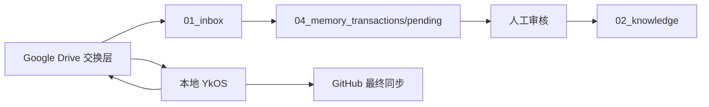
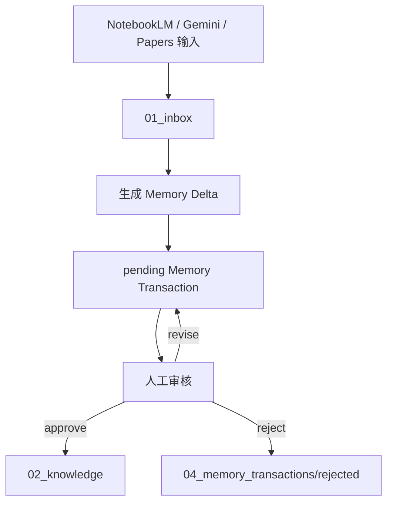
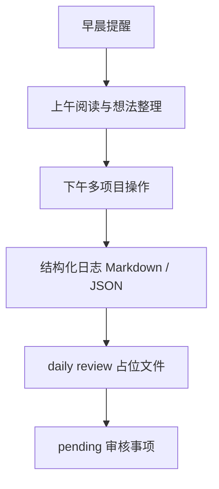
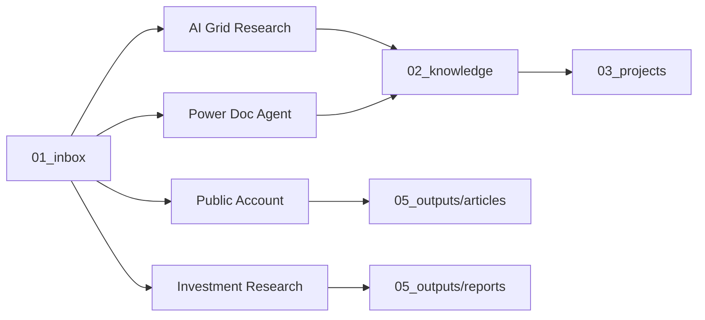

# YkOS 一天自动化模拟流程图

## Google Drive ↔ 本地 YkOS ↔ GitHub

```mermaid
flowchart LR
  Drive["Google Drive 交换层"] --> Inbox["01_inbox"]
  Inbox --> Pending["04_memory_transactions/pending"]
  Pending --> Review["人工审核"]
  Review --> Knowledge["02_knowledge"]
  Local["本地 YkOS"] --> GitHub["GitHub 最终同步"]
  Drive --> Local
  Local --> Drive
```

## Memory Transaction 流程

```mermaid
flowchart TD
  Input["NotebookLM / Gemini / Papers 输入"] --> Inbox["01_inbox"]
  Inbox --> Delta["生成 Memory Delta"]
  Delta --> Pending["pending Memory Transaction"]
  Pending --> Human["人工审核"]
  Human -->|approve| Knowledge["02_knowledge"]
  Human -->|revise| Pending
  Human -->|reject| Rejected["04_memory_transactions/rejected"]
```

## 每日 Review 流程

```mermaid
flowchart TD
  Morning["早晨提醒"] --> Work["上午阅读与想法整理"]
  Work --> Projects["下午多项目操作"]
  Projects --> Logs["结构化日志 Markdown / JSON"]
  Logs --> Review["daily review 占位文件"]
  Review --> Pending["pending 审核事项"]
```

## 项目模块关系

```mermaid
flowchart LR
  Inbox["01_inbox"] --> AIGrid["AI Grid Research"]
  Inbox --> PowerDoc["Power Doc Agent"]
  Inbox --> Public["Public Account"]
  Inbox --> Invest["Investment Research"]
  AIGrid --> Knowledge["02_knowledge"]
  PowerDoc --> Knowledge
  Public --> Outputs["05_outputs/articles"]
  Invest --> Outputs2["05_outputs/reports"]
  Knowledge --> Projects["03_projects"]
```
