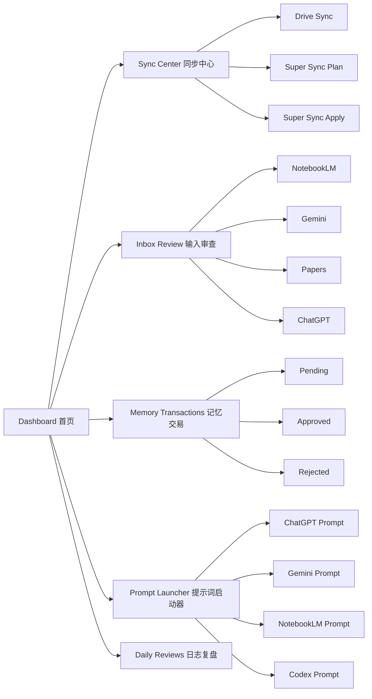

# YkOS Control Panel 设计规范

## 定位

YkOS Control Panel 是一个本地优先的小型 GUI，用于把 YkOS 的高频动作可视化：

- 一键同步 Google Drive、本地 YkOS、GitHub。
- 检查 inbox、pending Memory Transaction、daily review。
- 生成给 ChatGPT、Gemini、NotebookLM、Codex 使用的高质量提示词。
- 展示当前知识库状态、最近变更和风险。

它不是新的知识库，不替代 Markdown 文件，也不直接绕过人工审核。

## 仓库边界

控制面板应用程序不放在 YkOS 主知识库仓库中。

```text
E:\project\YkOS
```

只保存：

- Markdown 知识库。
- Memory Transaction。
- workflow / prompts / docs。
- 同步脚本。
- Control Panel 的设计规范、API 合同和项目说明。

```text
E:\project\YkOS-ControlPanel
```

保存：

- React / Vite 前端。
- 本地后端服务。
- `package.json`。
- 控制面板运行说明。

这样可以避免前端工程文件污染长期知识库，也避免在整理 Markdown 时误改应用代码。

## v0.4 MVP 原则

- 本地优先：所有真实知识库操作都围绕 `E:\project\YkOS`，控制面板应用位于 `E:\project\YkOS-ControlPanel`。
- Markdown 优先：GUI 只调取和展示 Markdown，不把数据锁进数据库。
- 脚本优先：后端优先复用现有 `scripts/ykos_sync.ps1` 和 `scripts/ykos_super_sync.ps1`。
- 可解释：每个按钮必须说明将执行什么脚本、会改哪些区域、是否会 commit/push。
- 先 Plan 后 Apply：所有危险动作默认先预演。
- 不直接写 `02_knowledge/`：正式知识库更新必须经过 pending 审核。

## 信息架构



## 核心页面

### 1. Dashboard 首页

目标：打开后 10 秒内知道 YkOS 当前是否健康。

必须显示：

- Google Drive 路径是否存在。
- GitHub ahead / behind 状态。
- pending Memory Transaction 数量。
- inbox 新文件数量。
- 最新 memory snapshot 文件。
- 最新 daily review 文件。
- 最近一次 sync 时间。

主要按钮：

- `检查状态`：只读扫描，不写文件。
- `生成今日简报提示词`：复制/展示给 ChatGPT 或 Gemini 的 prompt。
- `打开最新记忆快照`：打开 `05_outputs/reports/*ykos_memory_snapshot_for_drive.md`。

### 2. Sync Center 同步中心

目标：把命令行同步变成可理解的按钮。

按钮分组：

- `Drive Sync`：运行 `scripts/ykos_sync.ps1`。
- `Super Sync Plan`：运行 `scripts/ykos_super_sync.ps1 -Mode Plan`。
- `Super Sync Apply`：运行 `scripts/ykos_super_sync.ps1 -Mode Apply`。

安全提示：

- `Drive Sync` 会生成 pending 和 daily review，但不 commit / push。
- `Super Sync Plan` 不写文件、不 commit、不 push。
- `Super Sync Apply` 会同步、生成记录、commit、push。

输出区：

- 显示命令 stdout / stderr。
- 高亮风险词：`conflict`、`failed`、`error`、`behind`、`rebase`。
- 提供“复制日志”按钮。

### 3. Inbox Review 输入审查

目标：把散落的工具输出聚合成待处理清单。

读取目录：

- `01_inbox/notebooklm/`
- `01_inbox/gemini/`
- `01_inbox/chatgpt/`
- `01_inbox/papers/`
- `01_inbox/web/`
- `01_inbox/ideas/`

每条记录显示：

- 文件名
- 来源目录
- 修改时间
- 文件大小
- 是否已有对应 pending Memory Transaction

操作：

- `预览`
- `生成总结提示词`
- `生成 Memory Delta 草稿`
- `复制给 Gemini`
- `复制给 ChatGPT`

v0.4 不做自动语义总结，先生成高质量提示词，让外部 AI 工具完成总结。

### 4. Memory Transactions 记忆交易

目标：让 pending 审核变得可视化。

读取目录：

- `04_memory_transactions/pending/`
- `04_memory_transactions/approved/`
- `04_memory_transactions/rejected/`

v0.4 功能：

- 列表展示 pending。
- 预览 Markdown。
- 标记风险项。
- 生成“人工审核 checklist”。

暂不做：

- 自动 approve。
- 自动写入 `02_knowledge/`。
- 自动删除 pending。

### 5. Prompt Launcher 提示词启动器

目标：减少用户手写提示词成本。

内置 prompt：

- 今日简报
- 晚间复盘
- NotebookLM 输出整理
- Gemini 审核
- ChatGPT Project 更新
- Codex 本地仓库审计
- Memory Delta 生成

每个 prompt 必须：

- 自动包含当前 YkOS 路径。
- 自动说明来源目录。
- 要求输出 Memory Delta。
- 要求区分事实、推理、决策和风险。

### 6. Daily Reviews 日志复盘

目标：快速查看今天发生了什么。

读取目录：

- `06_reviews/daily/`

显示：

- 日期
- 文件名
- 摘要
- 关联 Memory Transaction
- 是否需要人工动作

## 后端能力边界

v0.4 后端位于 `E:\project\YkOS-ControlPanel\backend\`，只做本地文件和脚本编排：

- 读取文件树。
- 读取 Markdown。
- 调用 PowerShell 脚本。
- 生成 prompt 文本。
- 生成 pending Memory Transaction 草稿。
- 写入 `05_outputs/`、`06_reviews/`、`04_memory_transactions/pending/`。

后端禁止：

- 不接外部 API。
- 不做爬虫。
- 不做 MCP Server。
- 不直接修改 `02_knowledge/`。
- 不绕过人工审核。
- 不把 `.git` 同步到 Google Drive。

## 建议技术路线

### 本地后端

优先方案：

- Python 标准库 HTTP server，运行于独立控制面板项目。
- 不引入外部依赖。
- 通过 subprocess 调用 PowerShell 脚本。
- 返回 JSON 给前端。

可选方案：

- Node.js + 原生 `child_process`。
- Electron / Tauri 以后再考虑，不作为 v0.4 MVP。

### 前端

交给 Gemini 设计 UI，优先生成：

- 单页 Web App 原型。
- 静态 HTML/CSS/JS。
- 无外部依赖版本优先。
- 如果需要组件化，再进入后续版本。

## 关键交互

### 一键全部同步

```text
用户点击 Super Sync Plan
-> GUI 展示预演结果
-> 若无冲突，用户点击 Super Sync Apply
-> 后端运行脚本
-> GUI 展示 changed files / pending / review / git push 状态
```

### 快速调取知识库

```text
用户点击“打开最新记忆快照”
-> GUI 定位 05_outputs/reports 最新 ykos_memory_snapshot_for_drive 文件
-> 展示摘要和原文
-> 提供“复制给 Gemini / NotebookLM 的检阅指令”
```

### 整合工具输出

```text
用户点击“扫描 inbox”
-> GUI 列出 NotebookLM / Gemini / ChatGPT / Papers 文件
-> 用户选择文件
-> GUI 生成总结提示词
-> 用户复制到对应 AI 工具
-> AI 输出回写 Drive
-> ykos_sync 导入 inbox
-> 生成 pending Memory Transaction
```

## v0.4 Definition of Done

- 有一个可以打开的 GUI 首页。
- 能显示 Drive 路径、Git 状态、pending 数、inbox 数。
- 能运行 Drive Sync。
- 能运行 Super Sync Plan。
- 能展示脚本输出。
- 能生成 Gemini / NotebookLM / ChatGPT 检阅提示词。
- 能打开最新记忆快照。
- 不直接写正式知识库。

## Memory Delta

### New Facts

- 来源：用户 2026-05-20 请求
  - 事实：用户希望 YkOS 增加一个简单 GUI，用于同步、检阅、提示词生成和知识库调取。
- 来源：现有脚本
  - 事实：YkOS 已有 `scripts/ykos_sync.ps1` 和 `scripts/ykos_super_sync.ps1` 可作为 GUI 后端操作入口。

### Inference / Analysis

- GUI 的核心价值不是替代 Markdown，而是降低调用和审查成本。
- 前端设计可以交给 Gemini，但后端能力边界必须由 YkOS 本地规则定义。

### Decisions

- v0.4 GUI 先做本地控制面板，不做复杂 Agent 平台。
- 所有危险动作必须先 Plan 后 Apply。
- v0.4 不直接修改 `02_knowledge/`。

### Next Actions

- 让 Gemini 基于设计提示词生成 UI 原型。
- 本地 Codex 在 `E:\project\YkOS-ControlPanel` 中实现最小后端 API。
- 用真实 YkOS 文件和脚本测试 GUI。
